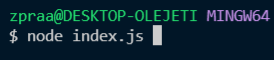
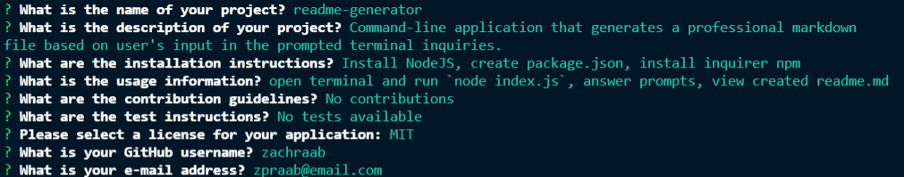
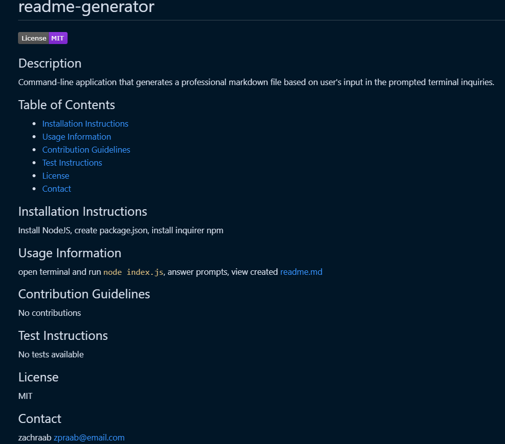

# readme-generator

---

## Description

This is a command-line application that allows the user to generate a professional markdown file based on the user's input in the prompted terminal inquiries with the help of nodejs.

## Table of Contents

- [Usage Instructions](#usage-instructions)
- [Installation Instructions](#installation-instructions)
- [Documentation](#documentation)
- [Walkthrough Demonstration](#walkthrough-demonstration)

## Usage Instructions

1. Initialize application by opening your terminal and running `node index.js`
   

2. Answer the prompted terminal inquiries.
   

3. If successful, the terminal will log :

   > `You've successfully created a README.md file!`

   

4. If unsuccessful, the terminal will log the error.

## Installation Instructions

1. Install NodeJS [HERE](https://nodejs.org/en/)

2. Create package.json by running the command `npm init -y`

3. Install inquirer npm by running the command `npm i inquirer`

## Documentation

- [NodeJS](https://nodejs.org/en/docs/)
- [Inquirer NPM](https://www.npmjs.com/package/inquirer#methods)

## Walkthrough Demonstration

[Link to Video]()
